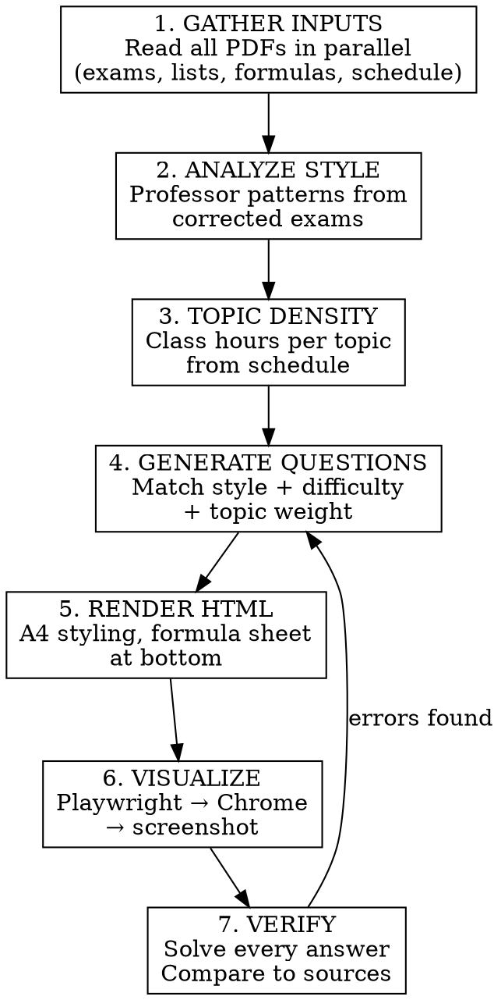

# Generating Exams from Course Materials

## Overview

Generate exams that match a professor's exact style, difficulty distribution, and topic weighting by analyzing corrected past exams + exercise lists + class schedule. Render to HTML, visualize in Chrome, verify all answers.

**Core principle:** The exam must be indistinguishable from one the professor would write. Style matching > topic coverage.

## When to Use

- Creating a new exam/prova for any discipline
- User provides PDFs of past exams, exercise lists, formula sheets
- User mentions "prova", "avaliação", "exame", "assessment"
- User wants exam based on "listas", "provas antigas", "correções"

**When NOT to use:**
- Creating exercise sets (not exams)
- Summarizing course content without exam format
- User only wants topic review without assessment

## Workflow



## Phase 1: Gather Inputs (Parallel Subagents)

Dispatch one subagent per PDF. Each returns FULL content verbatim.

**Required inputs:**
| Input | Purpose | What to extract |
|-------|---------|-----------------|
| Corrected exam(s) | Style + difficulty + format | Question types, weight per Q, wording patterns, topics |
| Exercise lists | Question bank | Problem statements, data sets, difficulty levels |
| Formula sheet | Available formulas | What students can reference (limits exam scope) |
| Class schedule | Topic density | Hours per topic → weight proportional to teaching time |

**Optional inputs:**
- Grading rubric → point distribution patterns
- Syllabus → exact topic names and ordering

**PDF reading strategy:**
```
# If Read tool works for PDFs:
read filePath="/path/to/file.pdf"

# If not (model limitation):
pdftotext "/path/to/file.pdf" /tmp/output.txt
read filePath="/tmp/output.txt"

# For image-based PDFs:
ocrmypdf input.pdf output_ocr.pdf
pdftotext output_ocr.pdf /tmp/output.txt
```

## Phase 2: Analyze Professor Style

From corrected exams, extract:

| Pattern | How to detect | Why it matters |
|---------|---------------|----------------|
| **Question format** | MC vs computational vs V/F vs fill-in | Students expect same format |
| **Weight distribution** | Equal (all 0.20) or varied (0.15–0.45) | Matches grading rubric |
| **Difficulty mix** | Count easy/medium/hard per exam | Balance |
| **Context themes** | Engineering, medical, industrial, everyday | Familiar framing |
| **Wording style** | Formal vs conversational, "determine"/"calcule"/"encontre" | Tone matching |
| **Justification depth** | "Justifique" vs "explique" vs none | Expectation setting |
| **Formula availability** | What's provided vs what's expected | Scope control |

**Style profile template:**
```
Professor: [name]
Format: [N questions × weight = total]
Difficulty: [N easy / N medium / N hard]
Question types: [MC, computational, V/F, fill-in]
Context: [engineering, medical, ...]
Wording: [formal/conversational]
Formulas provided: [list]
```

## Phase 3: Topic Density from Schedule

Map class hours to exam weight:

```
Topic weight = (topic hours / total hours) × exam total
```

**Example:**
| Topic | Hours | Weight (2.0 total) |
|-------|-------|---------------------|
| Descriptive stats | 6h | 6/24 × 2.0 = 0.50 |
| Probability | 12h | 12/24 × 2.0 = 1.00 |
| Random variables | 4h | 4/24 × 2.0 = 0.33 |
| Discrete distributions | 2h | 2/24 × 2.0 = 0.17 |

**If schedule unavailable:** Use corrected exam topic distribution as proxy.

## Phase 4: Generate Questions

### Difficulty calibration

| Level | Characteristics | Time estimate |
|-------|----------------|---------------|
| **Fácil** | Direct classification, single formula, fill-in table | 2–3 min |
| **Médio** | 2-step computation, interpretation, apply formula in context | 4–6 min |
| **Difícil** | Multi-step, combine concepts, derive, real-world problem | 7–10 min |

### Question generation rules

1. **New data, same structure.** Generate fresh datasets that fit the same problem template as past exams.
2. **Match the context domain.** If professor uses engineering contexts, don't switch to biology.
3. **Verify internal consistency.** Frequency tables must sum correctly. Probabilities must sum to 1. All values must be physically meaningful.
4. **Include formula sheet reference.** Only test formulas that are (or aren't) provided, matching past exam convention.
5. **Scale difficulty to weight.** Easy questions → lower weight. Hard questions → higher weight.

### Verification checklist per question

- [ ] All numerical answers correct (solve independently)
- [ ] Internal data consistency (tables sum, probabilities valid)
- [ ] Difficulty matches label
- [ ] Style matches professor profile
- [ ] Topic matches schedule weighting
- [ ] Formula sheet sufficient (or intentionally absent)

## Phase 5: Render to HTML

**Template structure:**
```html
<!DOCTYPE html>
<html lang="pt-BR">
<head>
  <meta charset="UTF-8">
  <title>[Discipline] – Prova [N] – [Year]</title>
  <style>
    @page { size: A4; margin: 18mm 16mm; }
    body { font-family: 'Times New Roman', serif; font-size: 11.5pt; }
    /* Table, question, formula box styles */
  </style>
</head>
<body>
  <div class="header">
    <!-- Course, discipline, module, year, professor, weight -->
  </div>

  <!-- Questions with .q, .qt, .sub classes -->
  <div class="q">
    <p class="qt">Questão NN (Peso: X,XX)</p>
    <!-- Question content -->
  </div>

  <!-- Formula box at bottom -->
  <div class="fbox">
    <h3>FÓRMULAS DISPONÍVEIS</h3>
    <!-- Formulas from formula sheet -->
  </div>
</body>
</html>
```

**Key CSS classes:**
- `.q` — question container (page-break-inside: avoid)
- `.qt` — question title (bold)
- `.sub` — sub-item (indented)
- `.alt` — alternative rows (left-aligned for MC)
- `.data` — monospace data blocks
- `.chart` — ASCII charts/graphs
- `.fbox` — formula box at bottom

## Phase 6: Visualize in Chrome

```bash
# 1. Start local server
cd /tmp && python3 -m http.server 8765 &

# 2. Navigate with Playwright
playwright_browser_navigate url="http://localhost:8765/exam.html"

# 3. Full-page screenshot
playwright_browser_take_screenshot fullPage=true scale=device \
  filename="/path/to/output.png"
```

**Alternative: Generate PDF directly**
```bash
# If weasyprint available:
weasyprint exam.html exam.pdf

# If wkhtmltopdf available:
wkhtmltopdf exam.html exam.pdf
```

## Phase 7: Verify Answers

Dispatch a verification subagent that:
1. Reads the HTML exam
2. Solves every question independently step-by-step
3. Checks internal consistency
4. Compares to source materials
5. Reports any errors

**Verification prompt template:**
```
Verify ALL questions in [file]. Solve each step by step.
Check: numerical correctness, internal consistency,
difficulty labels, formula sufficiency.
Return detailed report with any errors found.
```

## Quick Reference

| Step | Tool | Output |
|------|------|--------|
| Read PDFs | `pdftotext` or `read` | Raw text content |
| Analyze style | Subagent per exam | Style profile |
| Topic density | Schedule analysis | Weight per topic |
| Generate | Write HTML | Exam file |
| Visualize | Playwright + Chrome | Screenshot PNG |
| Verify | Subagent solver | Error report |
| PDF convert | weasyprint/wkhtmltopdf | Final PDF |

## Common Mistakes

| Mistake | Fix |
|---------|-----|
| Frequency tables don't sum to total | Verify: Σ freq = n, Σ rel.freq = 100% |
| Outlier value doesn't pass IQR test | Check: value < Q1−1.5·IQR before labeling |
| Sturges gives different k than specified | Use formula directly, don't hardcode k |
| Probability questions don't sum to 1 | Verify: Σ P(x) = 1 for all distributions |
| Wrong difficulty for question weight | Easy=0.10–0.15, Medium=0.15–0.20, Hard=0.20–0.30 |
| Style mismatch with professor | Re-read corrected exams, copy wording patterns |
| Missing topic from schedule | Cross-reference schedule hours with question coverage |
